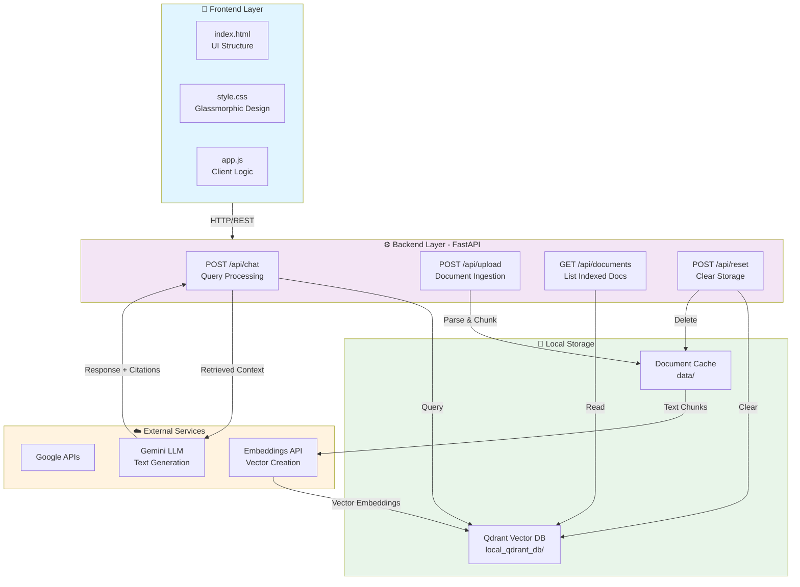

# 🤖 Antigravity RAG Chatbot

A state-of-the-art **Retrieval-Augmented Generation (RAG)** conversational AI powered by **FastAPI**, **Qdrant vector database**, and **Google Gemini LLMs**. Upload your documents, ask intelligent questions, and get grounded answers with precise source citations.

   

---

## 📋 Table of Contents

- [Key Features](#-key-features)
- [Architecture](#-architecture)
- [Tech Stack](#-tech-stack)
- [Installation](#-installation--setup)
- [Quick Start](#-quick-start)
- [Usage Guide](#-usage-guide)
- [API Reference](#-api-reference)
- [Project Structure](#-project-structure)
- [Troubleshooting](#-troubleshooting)
- [Future Improvements](#-future-improvements)

---

## ✨ Key Features

### Smart Document Processing
- **Multi-format support:** Parse PDF, TXT, and Markdown documents seamlessly
- **Intelligent chunking:** Semantic text splitting with overlap for better context preservation
- **Automatic embeddings:** Convert documents to vector embeddings using Google Embeddings API

### Advanced RAG Pipeline
- **Local vector database:** Qdrant runs in disk-based local mode—**zero cloud dependencies**
- **Semantic search:** Retrieve the most relevant document chunks from your knowledge base
- **Conversational context:** Maintain chat history for coherent multi-turn conversations

### Beautiful UI/UX
- **Glassmorphic design:** Modern, responsive interface with smooth animations
- **Drag-and-drop upload:** Intuitive document ingestion with visual progress indicators
- **Citations panel:** View exact source documents and text snippets referenced by the AI
- **Typing indicators:** Real-time feedback while processing queries

### Production Ready
- **Safe error handling:** Graceful fallbacks when API keys are missing or services unavailable
- **Memory management:** Reset functionality to clear vector store and local cache
- **RESTful API:** Clean endpoints for programmatic access and integration

---

## 🏗️ Architecture

The application follows a **three-tier architecture**:



### Data Flow - Step by Step

#### 📤 Document Ingestion Pipeline
1. User uploads PDF/TXT/MD file
2. Backend parses document & extracts text
3. Text split into semantic chunks with overlap
4. Each chunk sent to Google Embeddings API
5. Vector embeddings stored in Qdrant with metadata
6. Original document cached locally

#### 🔍 Query Processing Pipeline
1. User submits question in chat interface
2. Frontend sends query to `/api/chat` endpoint
3. Backend converts query to embedding vector
4. Semantic search in Qdrant retrieves top-k relevant chunks
5. Retrieved chunks + query sent to Google Gemini
6. Gemini generates answer with citations
7. Response streamed back to frontend with document references

#### 💬 Conversation Context Flow
- Chat history maintained in frontend state
- Each API call includes previous messages
- Gemini understands conversation context for follow-ups
- Citations tracked per response for source verification

---

## 🛠️ Tech Stack

| Component | Technology | Purpose |
|-----------|-----------|---------|
| **Backend** | FastAPI | RESTful API server with async support |
| **Vector DB** | Qdrant | Semantic search & embeddings storage |
| **LLM** | Google Gemini API | Conversational AI & text generation |
| **Embeddings** | Google Embeddings API | Convert text to vector representations |
| **Document Processing** | LangChain + PyPDF | Parse PDFs, TXT, and Markdown files |
| **Frontend** | Vanilla JS/HTML/CSS | Responsive UI with no framework bloat |
| **Server** | Uvicorn | ASGI server for FastAPI |

---

## 📦 Installation & Setup

### Prerequisites
- **Python 3.9** or higher
- **pip** (Python package manager)
- **Google Gemini API Key** (free tier available at [Google AI Studio](https://aistudio.google.com/))

### Step 1: Clone or Download the Project
```bash
cd path/to/Chatbot
```

### Step 2: Create a Virtual Environment (Recommended)
```bash
# On Windows
python -m venv venv
venv\Scripts\activate

# On macOS/Linux
python3 -m venv venv
source venv/bin/activate
```

### Step 3: Install Dependencies
```bash
pip install -r requirements.txt
```

### Step 4: Set Up Environment Variables
Create a `.env` file in the project root directory:
```ini
GEMINI_API_KEY=your_actual_api_key_here
```

**How to get your API key:**
1. Visit [Google AI Studio](https://aistudio.google.com/)
2. Click "Get API Key" → "Create API Key in new project"
3. Copy your key and paste it into `.env`

---

## 🚀 Quick Start

### Run the Server
```bash
uvicorn app.main:app --reload
```

**Expected output:**
```
INFO:     Uvicorn running on http://127.0.0.1:8000
INFO:     Application startup complete
```

### Open in Browser
Navigate to **[http://localhost:8000](http://localhost:8000)**

The Qdrant database will be automatically created at `./local_qdrant_db/` on first run.

---

## 📖 Usage Guide

### 1️⃣ Ask General Questions
Simply type a question in the chat input to get responses based on the model's training data:
- *"What is machine learning?"*
- *"Explain quantum computing in simple terms"*
- *"How do neural networks work?"*

### 2️⃣ Upload Documents
**Choose one method:**

**Method A - Drag & Drop**
- Drag PDF, TXT, or MD files directly into the chat area
- Visual progress indicator shows indexing status

**Method B - Browse Files**
- Click the **Browse Files** button in the sidebar
- Select one or multiple files to upload

**Supported formats:**
- `.pdf` - PDF documents (automatically parsed)
- `.txt` - Plain text files
- `.md` - Markdown files

### 3️⃣ Ask Document-Specific Questions
Once documents are uploaded, ask questions about their content:
- *"Summarize the key points from my document"*
- *"What does section 3 say about pricing?"*
- *"Extract all action items mentioned in the PDF"*

The chatbot will search your documents and cite the exact text chunks used to answer.

### 4️⃣ Inspect Citations
Below each response, document pills show the sources used:
- **Click a pill** to expand the **Snippet Drawer**
- See the exact text passage that was retrieved from your documents
- Verify answer accuracy against source material

### 5️⃣ Clear Memory
Click **Wipe Chatbot Memory** to:
- Delete all indexed vectors from the vector database
- Remove all uploaded documents from local cache
- Start fresh with a clean slate

### 6️⃣ Conversation Context
The chatbot maintains chat history automatically:
- Messages are sent with prior conversation context
- The model understands follow-up questions
- Ask multi-turn questions naturally

---

## 🔌 API Reference

All endpoints are accessible at `http://localhost:8000/api/`

### 1. Chat Endpoint
**POST** `/api/chat`

Send a query and optional chat history for RAG-powered responses.

**Request Body:**
```json
{
  "query": "What is the main topic of my document?",
  "history": [
    {"role": "user", "content": "What topics are covered?"},
    {"role": "assistant", "content": "The document covers..."}
  ]
}
```

**Response:**
```json
{
  "response": "The main topic is...",
  "citations": ["document1.pdf", "document2.txt"],
  "snippets": [
    {
      "document": "document1.pdf",
      "text": "Relevant passage from document...",
      "score": 0.95
    }
  ]
}
```

---

### 2. Upload Document Endpoint
**POST** `/api/upload`

Upload and index a document into the vector database.

**Request:** Form-data with file
```bash
curl -X POST -F "file=@document.pdf" http://localhost:8000/api/upload
```

**Response:**
```json
{
  "status": "success",
  "filename": "document.pdf",
  "chunks": 42,
  "message": "Successfully loaded 'document.pdf' and indexed 42 vector chunks."
}
```

---

### 3. List Documents Endpoint
**GET** `/api/documents`

Retrieve all documents currently indexed in the vector store.

**Response:**
```json
{
  "documents": ["document1.pdf", "document2.txt", "notes.md"]
}
```

---

### 4. Reset/Wipe Endpoint
**POST** `/api/reset`

Clear all vectors and local document cache.

**Response:**
```json
{
  "status": "success",
  "message": "Vector store and local cache cleared."
}
```

---

## 📁 Project Structure

```
Chatbot/
├── app/
│   ├── __init__.py                    # Package initialization
│   ├── main.py                        # FastAPI app, routes, and request handlers
│   ├── llm.py                         # Google Gemini integration & prompt templates
│   ├── vector_store.py                # Qdrant client, document processing & embeddings
│   └── static/
│       ├── index.html                 # Chat UI structure
│       ├── style.css                  # Glassmorphic styling & responsive layout
│       └── app.js                     # Client-side logic, file upload, chat management
│
├── data/                              # Cache directory for uploaded documents
│
├── local_qdrant_db/                   # Qdrant vector database (auto-created)
│   ├── meta.json                      # Database metadata
│   └── collection/
│       └── chatbot_knowledge/         # Document vectors collection
│
├── requirements.txt                   # Python dependencies
├── .env                               # Environment variables (API keys) - NOT in git
├── .gitignore                         # Git ignore rules
└── README.md                          # This file
```

### Key Files Explained

**`app/main.py`**
- FastAPI application setup
- HTTP route handlers for `/api/chat`, `/api/upload`, `/api/documents`, `/api/reset`
- Static file serving for frontend

**`app/llm.py`**
- Google Gemini API client configuration
- RAG prompt templates and response formatting
- Message history management

**`app/vector_store.py`**
- Qdrant client initialization and connection
- PDF/TXT/MD parsing and text extraction
- Semantic chunking with overlap
- Vector embedding and similarity search

**`app/static/app.js`**
- Chat message handling and display
- Real-time WebSocket or REST calls to backend
- Drag-and-drop file upload functionality
- Citation display and snippet drawer

---

## 🐛 Troubleshooting

### Issue: "GEMINI_API_KEY not found"
**Solution:**
1. Verify `.env` file exists in project root
2. Check key is set correctly: `GEMINI_API_KEY=sk-...`
3. Restart the server after updating `.env`

### Issue: Qdrant Connection Error
**Solution:**
1. Delete `local_qdrant_db/` folder
2. Restart the server—database will be recreated
3. Ensure disk space is available

### Issue: PDF Upload Fails
**Solution:**
1. Verify file is a valid PDF (not corrupted)
2. Check file size (very large PDFs may timeout)
3. Try converting PDF with external tool if still fails
4. Use TXT or MD format as alternative

### Issue: Slow Response Times
**Solution:**
1. Number of indexed documents? → More documents = slower search
2. Query complexity? → Complex queries take longer to embed
3. System resources? → Close other applications, increase RAM

### Issue: Responses Are Generic (Not Using Documents)
**Solution:**
1. Verify documents were uploaded successfully via `/api/documents`
2. Ask document-specific questions (not general knowledge)
3. Ensure query content matches document content
4. Try rephrasing question with keywords from documents

---

## 🚀 Future Improvements

- [ ] Multi-user support with authentication
- [ ] Cloud database options (Pinecone, Weaviate integration)
- [ ] Advanced chunking strategies (recursive, semantic)
- [ ] Web-based dashboard for analytics
- [ ] Conversation export (JSON, PDF)
- [ ] Custom LLM model selection (GPT-4, Claude, etc.)
- [ ] Fine-tuning support for domain-specific models
- [ ] Docker containerization for easy deployment
- [ ] Rate limiting and usage quotas
- [ ] Batch document processing

---

## 📄 License

This project is open source. Feel free to use, modify, and distribute.

---

## 🤝 Support

For issues, questions, or contributions:
1. Check the Troubleshooting section above
2. Review the API Reference for endpoint details
3. Inspect browser console and server logs for error messages

---

**Happy chatting! 🎉**
